# qt-industrial-equipment-monitor

> 基于 Qt/C++ 的工业设备远程监控管理平台 —— 实时数据采集、告警推送、远程控制。
>
> 本地开发在 **Windows（MinGW）**，CI 跑在 **Ubuntu** —— 每次推送都会在 Linux 上实测
> 构建（零警告门槛）、单元测试、以及 offscreen 运行冒烟。


## 项目简介

面向工业现场的**设备远程监控管理平台**桌面客户端。系统通过以太网 / 串口网关接入现场的 PLC、仪表与传感器，完成设备状态监测、实时数据采集与曲线展示、阈值告警、历史数据查询与远程指令下发，替代人工巡检，支撑设备运维的集中化管理。

典型场景：产线设备集中监控、无人值守站点巡检、设备台账与运维记录管理。

## 界面预览

下面的截图是程序**真实运行**时抓的（不是设计稿）：3 台模拟设备在线、5 类告警在活动、一条已录入处理结论。

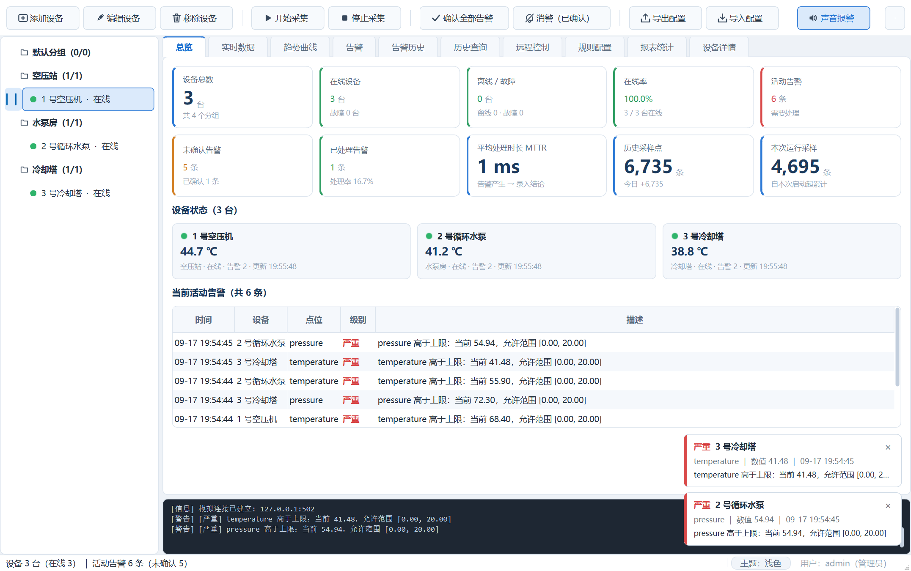

**总览仪表盘**：KPI 数字墙（设备 / 在线率 / 活动告警 / MTTR / 采样量）+ 每台设备一张状态卡 + 当前活动告警明细；点设备卡可直接下钻到该设备。

| 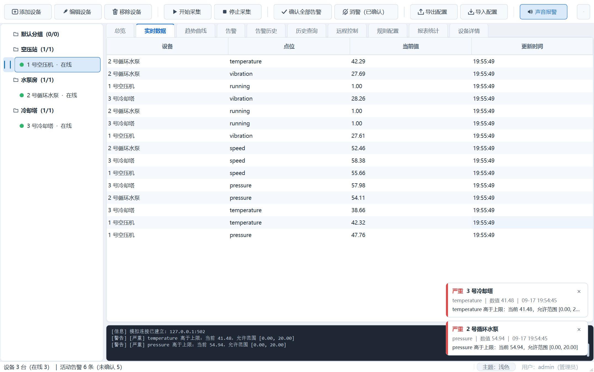 | 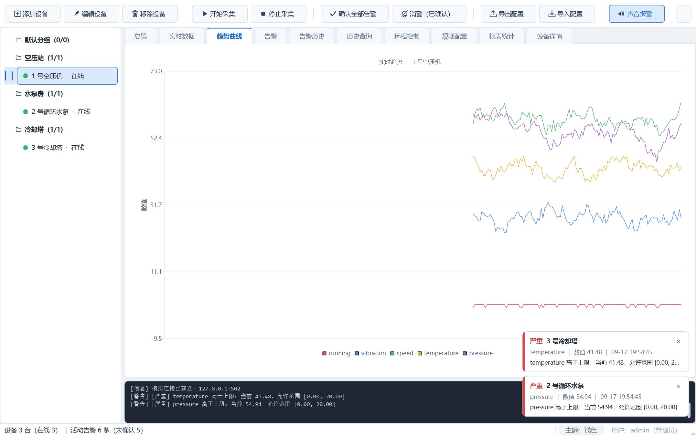 | 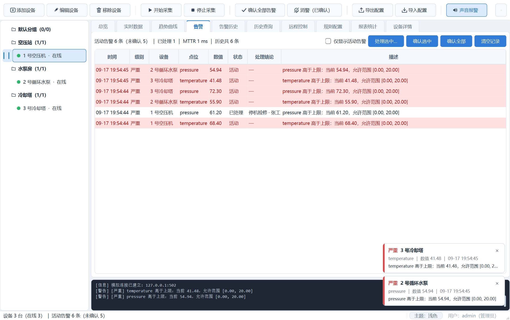 |
| --- | --- | --- |
| 实时数据（每设备独立线程采集） | 趋势曲线（缩放 / 平移 / 悬停准星） | 告警中心（状态四态 + 处理结论） |

| 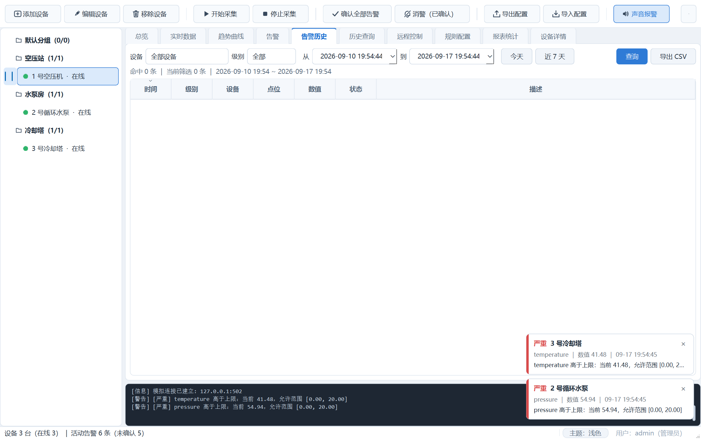 | 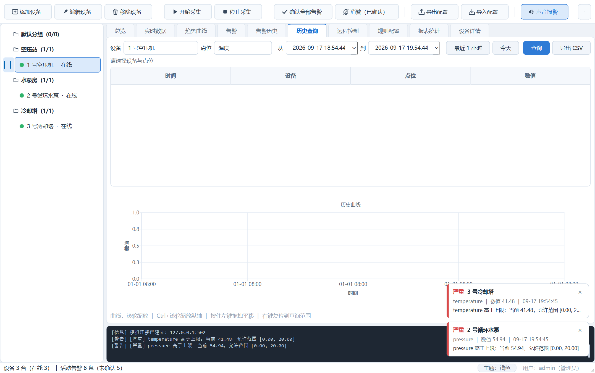 | 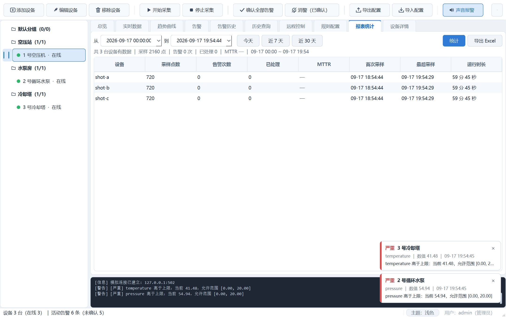 |
| --- | --- | --- |
| 告警历史（多条件查询） | 历史查询（表格 + 曲线 + CSV） | 报表统计（含已处理数与 MTTR） |

| 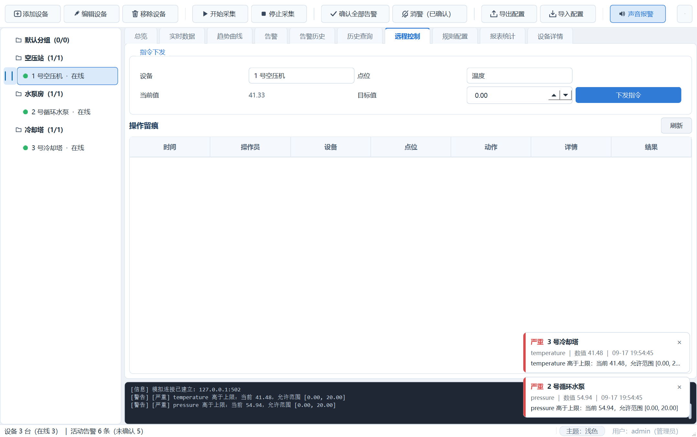 | 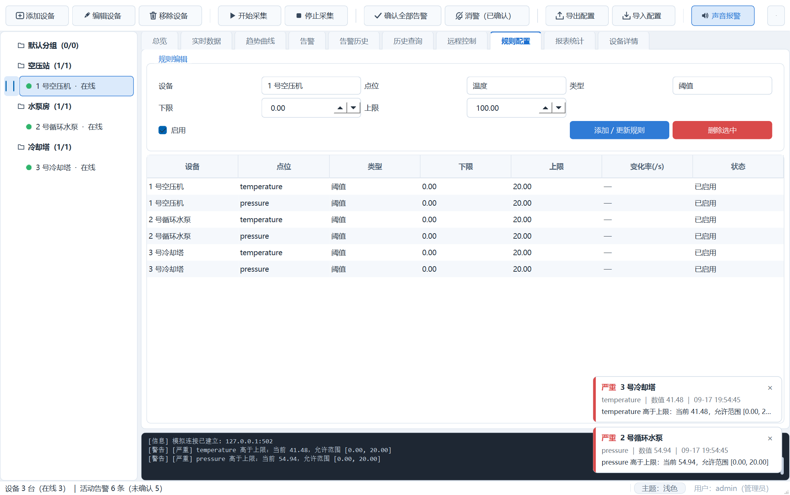 | 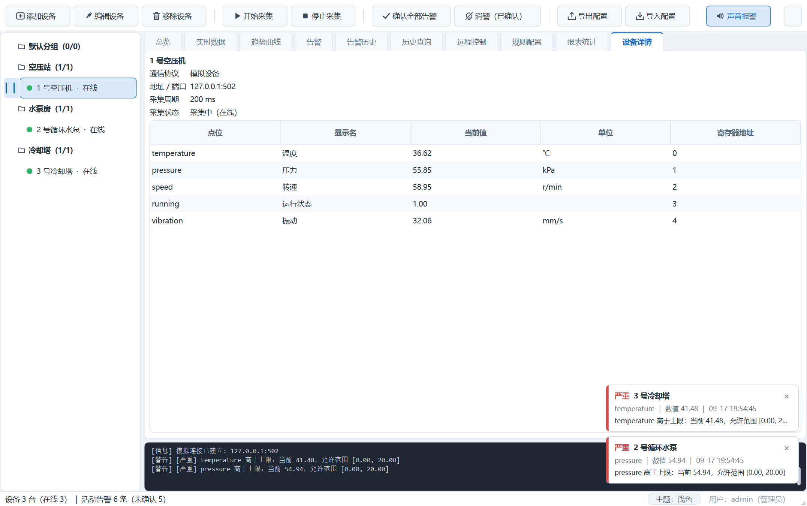 |
| --- | --- | --- |
| 远程控制（二次确认 + 留痕） | 规则配置 | 设备详情 |

## 核心功能

- [x] 设备接入管理：增删改设备，配置 IP/端口/从站地址，**支持分组**，断线自动重连（指数退避 1s→30s）
- [x] 设备状态总览：在线 / 离线 / 故障三态 + 状态灯，左侧分组树
- [x] **总览仪表盘（首页）**：KPI 数字墙（设备数 / 在线率 / 活动告警 / 采样量）+ 每台设备一张状态卡（状态灯 + 关键点位实时值 + 告警数）+ **当前活动告警明细列表**，**点设备卡直接下钻到该设备**
- [x] 实时数据采集：按采集周期轮询数据点，表格实时刷新（UI 侧 100ms 节流），**每台设备独立采集线程**
- [x] 实时/历史曲线：基于 `Qt Charts`，实时滚动 + 历史区间查询，**滚轮缩放 / 拖拽平移 / 悬停十字准星读数**
- [x] 告警引擎：阈值 / 变化率 / 离线三类告警，自动分级 + 告警列表，支持确认与消警
- [x] **告警工单闭环**：处理必须录入结论（处理人 / 分类 / 说明）并落库留痕，**统计 MTTR（平均修复时长）**；「确认」与「处理」是两个语义（看见了 ≠ 处理完了）
- [x] 告警体验：**系统托盘通知 + 浮动告警 Toast + 声音提示**，分级自动消隐、严重告警常驻
- [x] 告警历史：**独立的告警历史查询面板**（时间范围 + 等级 + 设备筛选，支持导出）
- [x] 远程控制：指令下发 + 二次确认 + 操作留痕（落库可查）
- [x] 历史数据：SQLite 本地存储（**批量事务写入**），按时间/设备/点位查询，导出 CSV
- [x] **数据不丢保障**：落库失败或数据库不可用时，采样自动溢出到磁盘队列（JSON Lines），下次启动按时间升序补传，**提交成功才删队列**
- [x] **长期运行保障**：日志按大小滚动（单文件 2 MB × 保留 5 份，不会把磁盘写满）；**崩溃自动写 minidump** 到 `dumps/`，现场无人值守也能留证
- [x] 用户与权限：登录、角色分级（操作员 / 管理员）
- [x] 报表与统计：设备运行时长、采样点数、告警次数、**已处理数与 MTTR**，**导出 Excel（.xls）**
- [x] 配置管理：**设备 / 分组 / 规则一键导出导入（JSON）**
- [x] 界面主题：**浅色 / 深色双主题一键切换**，矢量图标，设置持久化
- [x] **MQTT 接入鉴权**：设备可配置用户名 / 密码，CONNECT 报文带 User Name / Password 字段；broker 拒绝时按返回码给出明确原因（如"用户名或密码错误"）
- [x] **协议插件化**：`createConnection()` 里没有任何协议分支 —— 协议由**注册表**提供，内置协议与外部插件平权；外部插件是独立动态库，丢进 `plugins/protocols/` 即生效（**新增协议零重编译核心代码**）。设备对话框的协议列表与字段可见性也由插件的 `ProtocolTraits` 声明驱动
- [x] **单元测试 + CI**：`QTest` 覆盖告警状态机 / 工单闭环与 MTTR / 存储往返与溢出补传 / 配置往返 / 协议注册表，`ctest` 一行跑完；GitHub Actions 自动构建 + **零警告**门槛 + 跑测试

> 全部核心功能已落地，并完成多轮升级：界面视觉 / 告警体验 / 线程化架构 / 功能增强 → 总览仪表盘 / MQTT 接入鉴权 → **告警工单闭环与 MTTR**。

## 技术栈

| 层次 | 选型 |
| --- | --- |
| 界面框架 | Qt 6.x（Qt Widgets 为主，复杂交互页面可选 QML） |
| 语言标准 | C++17 |
| 构建 | CMake（>= 3.16），兼容 Qt Creator 直接打开 |
| 通信 | Modbus TCP（QTcpSocket 手写 MBAP + PDU）、MQTT 3.1.1（QTcpSocket 手写最小子集）、模拟数据源 |
| 数据可视化 | Qt Charts |
| 数据存储 | SQLite（Qt SQL），服务端场景可切 MySQL |
| 并发 | QThread / QThreadPool + 信号槽跨线程通信，采集线程与 UI 线程解耦 |
| 日志 | 文件日志 + 界面日志窗口 |

## 系统架构

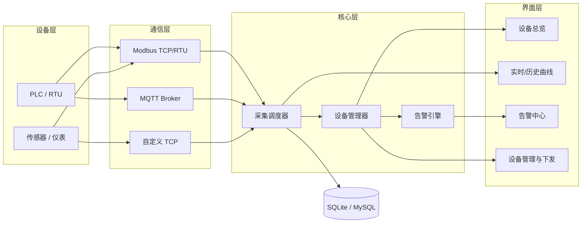

设计要点：通信层按协议抽象成统一接口（点位读 / 写 / 连接管理），**新增协议只改 `AcquisitionScheduler::createConnection()` 里一个 switch，上层零改动**；采集到的数据一律经信号槽投递给界面，界面不直接碰通信对象。

> 关于线程：采集已**线程化**——每台设备一个 `QThread` 工作线程，`DeviceConnection` 对象 `moveToThread` 到该线程，读写通过 `QMetaObject::invokeMethod` 跨线程调用；采样数据经队列 + 定时批量事务写入 SQLite（200ms / 200 行），避免高频小事务拖慢界面。

## 目录结构

```
qt-industrial-equipment-monitor/
├── CMakeLists.txt          # 顶层构建配置
├── CMakePresets.json       # VS Code / CLI 构建预设
├── CLAUDE.md               # AI 编码助手项目上下文（约定 + 已知坑）
├── ROADMAP.md              # 迭代计划（落点文件 + 验收标准 + 里程碑）
├── README.md
├── tools/                  # 零依赖 Python 模拟器（Modbus 从站 / MQTT 发布 / HTTP JSON 桩）
│   └── bench/              # 性能基线夹具（默认不编译，-DMONITOR_BUILD_BENCH=ON 打开）
├── tests/                  # 单元测试（QTest；链接 monitor_core —— 被测的就是产品跑的那份代码）
├── plugins/                # **外部协议插件**（各自编成独立动态库，产物落到 exe 旁的 plugins/protocols/）
│   └── http_json/          # HTTP / JSON 数据源插件 —— 也是"新增协议要写多少东西"的样板
├── docs/screenshots/       # 真实运行截图
├── .github/workflows/      # CI：构建 + 零警告门槛 + ctest
└── src/
    ├── CMakeLists.txt      # 产出两个目标：monitor_core（静态库，核心逻辑）+ 可执行文件（仅 main）
    ├── main.cpp            # 入口：全局主题 + 登录 + 组装
    ├── ui/                 # 界面层
    │   ├── theme.*             浅/深双主题 QSS + 矢量图标工厂
    │   ├── logindialog.*       登录 / 角色
    │   ├── mainwindow.*        主窗口（分组设备树 + 10 个功能页 + 权限控制）
    │   ├── overviewpanel.*     总览仪表盘（KPI 卡片墙 + 设备状态卡 + 下钻）
    │   ├── alarmpanel.*        告警面板（列表 / 确认 / 消警）
    │   ├── alarmnotifier.*     告警通知（托盘 / 浮动 Toast / 声音）
    │   ├── alarmhistorypanel.* 告警历史独立查询面板
    │   ├── advancedchartview.* 趋势曲线增强视图（缩放 / 平移 / 准星）
    │   ├── devicedialog.*      设备配置对话框（含分组与 MQTT 接入账号）
    │   ├── devicedetailpanel.* 设备详情
    │   ├── historypanel.*      历史查询（表格 + 曲线 + CSV）
    │   ├── rulepanel.*         告警规则配置
    │   ├── controlpanel.*      远程控制 + 操作留痕
    │   └── reportpanel.*       报表统计 + Excel 导出
    ├── comm/               # 通信层
    │   ├── deviceconnection.h  协议抽象接口（含 configure 入口）
    │   ├── protocolplugin.h    **协议插件接口**（元数据 + traits + 连接工厂）
    │   ├── protocolregistry.*  协议注册表：协议 id → 插件（内置与外部插件一视同仁）
    │   ├── builtinprotocols.cpp 三个内置协议以插件形式注册（mock / modbus_tcp / mqtt）
    │   ├── mockconnection.*    模拟数据源
    │   ├── modbusconnection.*  Modbus TCP（手写 MBAP / PDU）
    │   └── mqttconnection.*    MQTT 3.1.1（手写最小子集）
    ├── core/               # 设备模型、采集调度（线程化 + 自动重连）、告警引擎
    ├── storage/            # SQLite：采样 / 告警 / 操作 / 设备台账（批量写入）
    └── utils/              # 日志（进程内唯一 + 滚动）、配置导入导出、Excel 导出、崩溃转储
```

## 构建与运行

**环境要求**

- Qt 6.x（`QtCharts` 可选，缺了会自动禁用图表页；`QtSql` 必需）
- CMake >= 3.16，编译器支持 C++17（GCC 9+ / MSVC 2019+）

### Linux

```bash
# Ubuntu / Debian：Qt6 + 图表模块 + SQLite 驱动
sudo apt-get install -y build-essential cmake ninja-build \
    qt6-base-dev qt6-charts-dev libqt6sql6-sqlite libgl1-mesa-dev

cmake -S . -B build -G Ninja -DCMAKE_BUILD_TYPE=Release
cmake --build build --parallel

# 运行
./build/src/qt-industrial-equipment-monitor

# 无显示器的环境（服务器 / 容器 / CI）用 offscreen 平台
QT_QPA_PLATFORM=offscreen ./build/src/qt-industrial-equipment-monitor
```

- 图表页是可选依赖：`qt6-charts-dev` 装不上也照样能构建，趋势曲线页自动禁用。
- 协议插件产物落在 `build/src/plugins/protocols/*.so`，程序启动时自动扫描加载。
- 数据库与日志默认写到 `~/.local/share/Y71jj123/qt-industrial-equipment-monitor/`。

### Windows

```bash
# 1. 配置（把 CMAKE_PREFIX_PATH 换成你的 Qt 安装路径）
cmake -S . -B build -DCMAKE_PREFIX_PATH="C:/Qt/6.11.2/mingw_64"

# 2. 编译（Release 出包 / Debug 调试，预设见 CMakePresets.json）
cmake --build build --config Release

# 3. 运行
./build/src/qt-industrial-equipment-monitor.exe
```

### Qt Creator

打开 `CMakeLists.txt` → 选择 Kit → 直接点运行。

### 跨平台验证状态

| | Windows（本地：MinGW 13.1 + Qt 6.11.2） | Linux（CI：Ubuntu + Qt 6.5.3） |
| --- | --- | --- |
| 构建（`-Wall -Wextra` 零警告） | ✅ 本地实测 | ✅ CI 硬门槛 |
| 单元测试（4 套件 / 38 个用例） | ✅ | ✅ CI 每次推送都跑 |
| 运行（GUI 起得来 + 协议插件加载） | ✅ 本地实测 | CI offscreen 冒烟（状态看顶部徽章） |

> Linux 那一列全部由 GitHub Actions 实测：构建 → 零警告门槛 → `ctest` → offscreen 运行冒烟
> （启动存活 + 从日志确认协议插件被加载）。步骤见
> [`.github/workflows/build.yml`](./.github/workflows/build.yml)，最新状态看顶部 CI 徽章。

**打包成可双击运行的 exe（Windows）**

编译产物默认只依赖 `E:\Qt` 里的 Qt DLL，**直接双击会报"找不到 Qt6Core.dll"**。
把依赖拷到 exe 旁边即可（做一次就行，`clean` 重建后需要重做）：

```bash
E:/Qt/6.11.2/mingw_64/bin/windeployqt.exe --no-translations \
    build-vscode/src/qt-industrial-equipment-monitor.exe
```

之后 `build-vscode/src/` 里会出现 `Qt6*.dll` + `platforms/` + `sqldrivers/`，双击 exe 就能跑。

**打成可发布的安装包（CPack）**

```bash
# ⚠️ 出包请用 Release —— Debug 的包又大又慢（本机实测：Debug 约 41 MB，
#    且运行时性能明显低于 README「性能基线」里那份 Release 数字）
cmake --preset qt-mingw-release          # 或者手动 -DCMAKE_BUILD_TYPE=Release
cmake --build --preset qt-mingw-release-build --parallel

# 装到一个目录，看一下产物结构
cmake --install build-release --prefix dist

# 打成压缩包（默认 ZIP；想做成安装器加 -DCPACK_GENERATOR=NSIS，需本机有 makensis）
cd build-release && cpack -G ZIP
```

产物：`build-release/qt-industrial-equipment-monitor-<版本>-win64.zip`（Release，**约 27 MB**；
同样内容用 Debug 出包是 41 MB —— exe 一个 1.4 MB 一个 30 MB，差别全在这里）。

包内结构是**解压即用**的：

```
qt-industrial-equipment-monitor-<版本>-win64/
├── bin/                      可执行文件 + Qt6*.dll + qt.conf
├── plugins/                  平台插件 / SQL 驱动
│   └── protocols/            **协议插件**（外部协议动态库放这里，程序会自动加载）
├── README.md
└── LICENSE
```

> Qt 的运行时依赖由 `qt_generate_deploy_app_script()` 在安装阶段自动带上，
> 不会再出现"装完双击报找不到 Qt6Core.dll"这种半成品包。
> 翻译文件用 `NO_TRANSLATIONS` 排除了 —— 界面文案全是中文硬编码，带一堆 `qt_*.qm` 只是白占 20+ MB。

**跑单元测试**

核心逻辑（告警引擎、存储、配置、协议组包）有 QTest 覆盖，一条命令跑完：

```bash
ctest --test-dir build --output-on-failure
```

当前三个套件：`tst_alarmengine`（状态机 / 工单闭环 / MTTR 分级）、
`tst_datastorage`（告警落库与 NULL 语义 / 统计口径 / 采样溢出队列与补传顺序）、
`tst_configio`（点位表与整份配置往返，含 MQTT 账号）。

> 测试链接的是 `monitor_core` 静态库 —— 也就是主程序实际用的那份代码，
> 不是把源码再编译一遍的"影子实现"。CI 里还会把编译警告视为失败。

**默认账号**（演示用，见 `src/ui/logindialog.cpp`）

| 用户名 | 密码 | 角色 | 权限 |
| --- | --- | --- | --- |
| `admin` | `admin123` | 管理员 | 全部功能 |
| `operator` | `operator123` | 操作员 | 只读查看 + 确认告警 |

> 首次拉取后若找不到 Qt，检查环境变量或直接在 `.workbuddy` 之外维护本地 `CMakeUserPresets.json`（已 gitignore）。

## 不接硬件也能联调（本地模拟器）

`tools/` 下有两个**零依赖**（纯 Python 标准库，不用 pip 装任何东西）的模拟器，
可以在没有真 PLC / 网关的情况下把通信链路完整跑通。

### 一、Modbus TCP：本机模拟一台 PLC

```bash
python tools/modbus_slave_sim.py             # 监听 127.0.0.1:5020
python tools/modbus_slave_sim.py --port 5021 # 想模拟多台设备就换端口
```

然后在客户端「添加设备」里填：

| 字段 | 值 |
| --- | --- |
| 协议 | `Modbus TCP` |
| 地址 | `127.0.0.1` |
| 端口 | `5020` |
| 从站地址 | `1` |
| 点位表「缩放」 | **全部改成 `0.01`** |

寄存器映射：`0=温度 1=压力 2=转速 3=运行状态 4=振动`，寄存器里存的是「工程值 × 100」，
所以缩放填 0.01。数值每秒按"均值回归 + 噪声"更新，会自然地在阈值附近波动，方便观察告警。

### 二、MQTT：往 broker 发模拟数据

```bash
# 公共测试 broker（需联网）
python tools/mqtt_publisher_sim.py --host broker.emqx.io --topic factory/line1

# broker 要求账号时（与设备里的「接入账号 / 密码」填一致）
python tools/mqtt_publisher_sim.py --host 127.0.0.1 --topic factory/line1 \
    --username factory --password secret
```

然后在客户端「添加设备」里填：协议 `MQTT`、地址 `broker.emqx.io`（或 `127.0.0.1`）、端口 `1883`、
订阅主题 `factory/line1/#`；broker 若开启鉴权，再把「接入账号 / 接入密码」填上（**留空即匿名接入**）。
脚本每秒发一次数据，支持 `--mode json`（默认）与 `--mode single` 两种格式。

> 这两个脚本同时也是**协议格式的活文档** —— 想知道项目期望什么报文，看它们即可。
> MQTT 鉴权采用 3.1.1 的明文 User Name / Password 字段，不加密时等同于明文口令，仅适合内网环境。

## 新增一种协议要写多少东西

这是"协议插件化"最直接的检验。**答案是一个头文件、一个 cpp、四行 CMake，核心代码零改动。**

```cpp
// 1) 实现连接（继承 DeviceConnection，只做收发）
class MyConnection : public DeviceConnection { /* open/close/readTag/writeTag */ };

// 2) 实现插件（元数据 + 工厂）—— 就这十几行
class MyProtocolPlugin : public QObject, public IProtocolPlugin
{
    Q_OBJECT
    Q_PLUGIN_METADATA(IID MonitorProtocolPlugin_iid)
    Q_INTERFACES(IProtocolPlugin)
public:
    QString id() const override { return QStringLiteral("my_protocol"); }
    QString displayName() const override { return QStringLiteral("我的协议"); }
    quint16 defaultPort() const override { return 9999; }
    ProtocolTraits traits() const override { ProtocolTraits t; t.usesSlaveId = true; return t; }
    DeviceConnection *create() const override { return new MyConnection(); }
};
```

```cmake
add_library(monitor_protocol_my MODULE myprotocol.cpp)
target_include_directories(monitor_protocol_my PRIVATE ${MONITOR_SRC_DIR})
target_link_libraries(monitor_protocol_my PRIVATE monitor_core Qt6::Network)
set_target_properties(monitor_protocol_my PROPERTIES RUNTIME_OUTPUT_DIRECTORY "${MONITOR_PROTOCOL_DIR}")
```

编出来把 `.dll` 丢进 `<exe>/plugins/protocols/` 即可 —— **主程序不需要重新编译**，
设备对话框里会自动多出一个选项，字段可见性由你声明的 `traits` 决定。

> 完整可运行的样板见 [`plugins/http_json/`](./plugins/http_json)。它同时是个有用的插件：
> 很多现场网关不给 Modbus，只暴露一个返回 JSON 的 HTTP 接口。
>
> **别把某个插件的 `.dll` 删掉试试**：程序照样正常启动，只是协议列表里少一项 ——
> 这就是"可插拔"的验收方式。

## 性能基线

数字不是估的，是跑出来的。夹具留在仓库里（`tools/bench/`，默认不编译），**随时可以复现**：

```bash
cmake -S . -B build-bench -DCMAKE_BUILD_TYPE=Release \
      -DCMAKE_PREFIX_PATH="<你的 Qt 路径>" -DMONITOR_BUILD_BENCH=ON -DBUILD_TESTING=OFF
cmake --build build-bench --parallel
./build-bench/tools/bench/monitor_bench.exe            # 默认 100 台 × 10 点位 × 1s
./build-bench/tools/bench/monitor_bench.exe --devices 500 --points 10
```

**测试环境**：AMD Ryzen 7 7840H（16 逻辑核）/ 23 GB / Windows 11 家庭版中文版 /
MinGW 13.1 + Qt 6.11.2 / **Release 构建**（`cmake --preset qt-mingw-release`）/ SQLite 走 `QSQLITE` 驱动。
夹具测的是**「采集 → 落库」这条链路，不含界面渲染** —— 渲染受显示器与窗口大小影响，
测出来的数字没有可比性。

### A. 端到端吞吐（每台设备独立采集线程 + 攒批落库）

| 规模 | 稳态采样速率 | 进程 CPU（单核口径） | 内存工作集 | 落库结果 |
| --- | --- | --- | --- | --- |
| 100 台 × 10 点位 × 1 s | **1000 点/秒** | **9.5 %**（整机 0.6 %） | 26.8 → 28.4 MB | 24020 行 / 4.8 MB，**采集数 = 落库行数，零丢失** |
| 500 台 × 10 点位 × 1 s | **4999 点/秒** | **53.6 %**（整机 3.3 %） | 51.4 → 51.6 MB | 120020 行 / 24.0 MB，**零丢失** |

几个结论：

- **"零丢失"是逐条比对出来的**：夹具同时数采集回调次数与数据库行数，两者必须严格相等。
  批量写入最容易出的问题就是"悄悄少写几条"，只看界面是发现不了的。
- 负载涨 5 倍，CPU 涨 5.6 倍、内存只涨 1.8 倍 —— **扩展性基本线性**，
  内存主要花在 500 条采集线程上（约 100 KB/台）。
- 1000 点/秒只吃掉单核的约十分之一，**单核余量还有近一个数量级**（这是外推，不是实测）。
- 预热期的速率低于稳态（100 台那行预热 5 秒只采到 4020 点）：线程与连接是逐台建立的，
  规模越大越需要更长的预热时间 —— 夹具因此把预热段单独隔离，不计入统计。

### B. 写库：攒批事务 vs 逐条事务

同一个数据库文件、同一张 `samples` 表，两种写法各写一遍：

| 条数 | 攒批一个事务（本项目做法） | 逐条各提交一次事务 | 提速 |
| --- | --- | --- | --- |
| 3000 | 136 ms → **22059 条/秒** | 14770 ms → 203 条/秒 | **108.6 ×** |
| 1000 | 45 ms → **22222 条/秒** | 4892 ms → 204 条/秒 | **108.7 ×** |

两次跑出来的一致性很好（都在 110 倍附近），说明答案不依赖数据量：
**瓶颈是 fsync 的次数，不是数据量**。SQLite 默认每条 `INSERT` 各提交一次 = 各自一次落盘，
攒成一个事务之后几百条只落一次盘 —— 这就是 `DataStorage` 里那个 200ms / 200 条批次
真正的价值所在（而不是"少几次函数调用"）。

按 22000 条/秒的写库能力，采集侧（5000 点/秒）离写库瓶颈还有 4 倍余量，
**当前的瓶颈在采集线程数与 CPU，不在存储**。

### ⚠️ 基线暴露出来的一个已知缺口：数据保留策略

每行采样约 **209 字节**（含索引）。按 1000 点/秒连续跑一天：

```
1000 点/秒 × 209 字节 ≈ 209 KB/s ≈ 17.6 GB/天
```

**当前没有清理 / 归档 / 降采样机制，数据库会一直长大。**
短时演示没问题（几 MB），但接现场长期跑必须补：至少要有"只保留最近 N 天原始数据 +
更早数据降采样"的策略。已记进 [ROADMAP.md](./ROADMAP.md) 的待办。

## 开发约定

- 命名：类名大驼峰 `DeviceManager`，函数小驼峰 `readHoldingRegister()`，成员变量 `m_` 前缀
- 跨线程数据一律走信号槽，禁止在工作线程直接操作界面控件
- 每个数据点（Tag）必须有唯一 `deviceId + tagId`，告警与历史记录以此为主键关联
- 提交前跑 `ctest`；界面改动附截图

## Roadmap

> **完整的迭代计划见 [ROADMAP.md](./ROADMAP.md)** —— 含每项的落点文件、验收标准与里程碑。
> 下面是已完成部分。

- [x] v0.1 设备接入 + 实时数据展示
- [x] v0.2 告警引擎 + 历史曲线
- [x] v0.3 远程控制 + 用户权限
- [x] v0.4 报表导出与运维统计
- [x] v0.5 体验升级：双主题视觉、告警通知体系、采集线程化、曲线交互、配置导入导出、Excel 报表
- [x] v0.6 总览仪表盘（KPI 墙 + 设备状态卡 + 下钻）、MQTT 接入鉴权（CONNECT 账号字段 + 拒绝原因可读）
- [ ] v0.7 业务闭环：告警工单与 MTTR（✅ 已完成）、断线补传与数据不丢（✅ 已完成）、Modbus 块读 + 串口 RTU
- [x] v0.8 技术深度：协议插件化（✅）、单元测试 + CI（✅）、性能基线报告（✅）
- [x] v1.0 产品化：安装包（✅）、运行截图（✅）、日志滚动与崩溃转储（✅）

## 许可

[MIT](./LICENSE) © 2026
