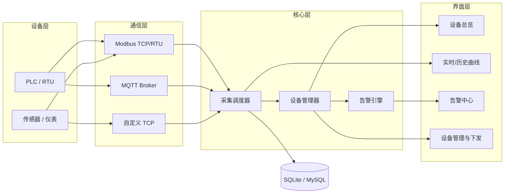

# qt-industrial-equipment-monitor

> 基于 Qt/C++ 的工业设备远程监控管理平台 —— 实时数据采集、告警推送、远程控制。


## 项目简介

面向工业现场的**设备远程监控管理平台**桌面客户端。系统通过以太网 / 串口网关接入现场的 PLC、仪表与传感器，完成设备状态监测、实时数据采集与曲线展示、阈值告警、历史数据查询与远程指令下发，替代人工巡检，支撑设备运维的集中化管理。

典型场景：产线设备集中监控、无人值守站点巡检、设备台账与运维记录管理。

## 核心功能

- [x] 设备接入管理：增删改设备，配置 IP/端口/从站地址，断线自动重连
- [x] 设备状态总览：在线 / 离线 / 故障三态，心跳检测与状态灯
- [x] 实时数据采集：按采集周期轮询数据点，数值与开关量分类展示
- [x] 实时/历史曲线：基于 `Qt Charts` 的多通道趋势曲线，支持缩放与时间范围选择
- [ ] 告警引擎：阈值/变化率/离线告警，弹窗 + 声音 + 告警列表，支持确认与消警
- [ ] 远程控制：指令下发与二次确认，操作留痕
- [ ] 历史数据：SQLite 本地存储，按时间/设备/点位查询，导出 CSV
- [ ] 用户与权限：登录、角色分级（操作员 / 管理员）
- [ ] 报表与统计：设备运行时长、故障次数统计

> 未勾选项为规划中的功能，欢迎一起推进。

## 技术栈

| 层次 | 选型 |
| --- | --- |
| 界面框架 | Qt 6.x（Qt Widgets 为主，复杂交互页面可选 QML） |
| 语言标准 | C++17 |
| 构建 | CMake（>= 3.16），兼容 Qt Creator 直接打开 |
| 通信 | Modbus TCP / RTU（QModbus）、MQTT（Qt MQTT）、自定义 TCP（QTcpSocket） |
| 数据可视化 | Qt Charts |
| 数据存储 | SQLite（Qt SQL），服务端场景可切 MySQL |
| 并发 | QThread / QThreadPool + 信号槽跨线程通信，采集线程与 UI 线程解耦 |
| 日志 | 文件日志 + 界面日志窗口 |

## 系统架构



设计要点：**采集线程不碰 UI**，所有数据经信号槽队列投递到主线程；通信层按协议抽象成统一接口（点位读 / 写 / 连接管理），新增协议不改上层代码。

## 目录结构

```
qt-industrial-equipment-monitor/
├── CMakeLists.txt          # 顶层构建配置
├── src/
│   ├── main.cpp
│   ├── ui/                 # 界面：主窗口、设备面板、曲线、告警中心
│   ├── comm/               # 通信层：协议接口 + Modbus/MQTT/TCP 实现
│   ├── core/               # 设备模型、采集调度、告警引擎
│   ├── storage/            # SQLite 历史数据与配置持久化
│   └── utils/              # 日志、配置、通用工具
├── docs/                   # 通信协议约定、数据库设计、界面说明
├── tests/                  # 单元测试（Qt Test）
└── 3rdparty/               # 第三方依赖
```

## 构建与运行

**环境要求**

- Qt 6.x（需包含 `QtCharts`、`QtSql`，用到 MQTT 再加 `QtMqtt`）
- CMake >= 3.16，编译器支持 C++17（MSVC 2019+ / GCC 9+）

**命令行构建**

```bash
# 1. 配置（把 CMAKE_PREFIX_PATH 换成你的 Qt 安装路径）
cmake -S . -B build -DCMAKE_PREFIX_PATH="C:/Qt/6.5.3/msvc2019_64"

# 2. 编译
cmake --build build --config Release

# 3. 运行（Linux 下无需 --config）
./build/src/qt-industrial-equipment-monitor
```

**Qt Creator**

打开 `CMakeLists.txt` → 选择 Kit → 直接点运行。

> 首次拉取后若找不到 Qt，检查环境变量或直接在 `.workbuddy` 之外维护本地 `CMakeUserPresets.json`（已 gitignore）。

## 开发约定

- 命名：类名大驼峰 `DeviceManager`，函数小驼峰 `readHoldingRegister()`，成员变量 `m_` 前缀
- 跨线程数据一律走信号槽，禁止在工作线程直接操作界面控件
- 每个数据点（Tag）必须有唯一 `deviceId + tagId`，告警与历史记录以此为主键关联
- 提交前跑 `ctest`；界面改动附截图

## Roadmap

- [ ] v0.1 设备接入 + 实时数据展示（当前阶段）
- [ ] v0.2 告警引擎 + 历史曲线
- [ ] v0.3 远程控制 + 用户权限
- [ ] v0.4 报表导出与运维统计

## 许可

[MIT](./LICENSE) © 2026
