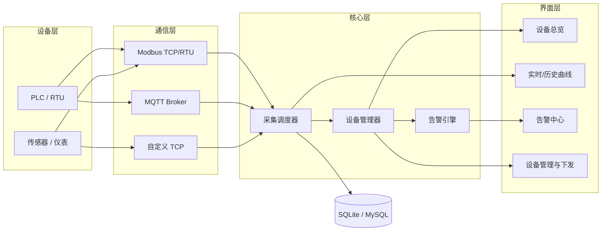

# qt-industrial-equipment-monitor

> 基于 Qt/C++ 的工业设备远程监控管理平台 —— 实时数据采集、告警推送、远程控制。


## 项目简介

面向工业现场的**设备远程监控管理平台**桌面客户端。系统通过以太网 / 串口网关接入现场的 PLC、仪表与传感器，完成设备状态监测、实时数据采集与曲线展示、阈值告警、历史数据查询与远程指令下发，替代人工巡检，支撑设备运维的集中化管理。

典型场景：产线设备集中监控、无人值守站点巡检、设备台账与运维记录管理。

## 核心功能

- [x] 设备接入管理：增删改设备，配置 IP/端口/从站地址，**支持分组**，断线自动重连（指数退避 1s→30s）
- [x] 设备状态总览：在线 / 离线 / 故障三态 + 状态灯，左侧分组树
- [x] **总览仪表盘（首页）**：KPI 数字墙（设备数 / 在线率 / 活动告警 / 采样量）+ 每台设备一张状态卡（状态灯 + 关键点位实时值 + 告警数）+ **当前活动告警明细列表**，**点设备卡直接下钻到该设备**
- [x] 实时数据采集：按采集周期轮询数据点，表格实时刷新（UI 侧 100ms 节流），**每台设备独立采集线程**
- [x] 实时/历史曲线：基于 `Qt Charts`，实时滚动 + 历史区间查询，**滚轮缩放 / 拖拽平移 / 悬停十字准星读数**
- [x] 告警引擎：阈值 / 变化率 / 离线三类告警，自动分级 + 告警列表，支持确认与消警
- [x] 告警体验：**系统托盘通知 + 浮动告警 Toast + 声音提示**，分级自动消隐、严重告警常驻
- [x] 告警历史：**独立的告警历史查询面板**（时间范围 + 等级 + 设备筛选，支持导出）
- [x] 远程控制：指令下发 + 二次确认 + 操作留痕（落库可查）
- [x] 历史数据：SQLite 本地存储（**批量事务写入**），按时间/设备/点位查询，导出 CSV
- [x] 用户与权限：登录、角色分级（操作员 / 管理员）
- [x] 报表与统计：设备运行时长、采样点数、告警次数统计，**导出 Excel（.xls）**
- [x] 配置管理：**设备 / 分组 / 规则一键导出导入（JSON）**
- [x] 界面主题：**浅色 / 深色双主题一键切换**，矢量图标，设置持久化
- [x] **MQTT 接入鉴权**：设备可配置用户名 / 密码，CONNECT 报文带 User Name / Password 字段；broker 拒绝时按返回码给出明确原因（如"用户名或密码错误"）

> 全部核心功能已落地，并完成两轮升级：第一轮为界面视觉 / 告警体验 / 线程化架构 / 功能增强，第二轮为总览仪表盘 / MQTT 接入鉴权。

## 技术栈

| 层次 | 选型 |
| --- | --- |
| 界面框架 | Qt 6.x（Qt Widgets 为主，复杂交互页面可选 QML） |
| 语言标准 | C++17 |
| 构建 | CMake（>= 3.16），兼容 Qt Creator 直接打开 |
| 通信 | Modbus TCP（QTcpSocket 手写 MBAP + PDU）、MQTT 3.1.1（QTcpSocket 手写最小子集）、模拟数据源 |
| 数据可视化 | Qt Charts |
| 数据存储 | SQLite（Qt SQL），服务端场景可切 MySQL |
| 并发 | QThread / QThreadPool + 信号槽跨线程通信，采集线程与 UI 线程解耦 |
| 日志 | 文件日志 + 界面日志窗口 |

## 系统架构



设计要点：通信层按协议抽象成统一接口（点位读 / 写 / 连接管理），**新增协议只改 `AcquisitionScheduler::createConnection()` 里一个 switch，上层零改动**；采集到的数据一律经信号槽投递给界面，界面不直接碰通信对象。

> 关于线程：采集已**线程化**——每台设备一个 `QThread` 工作线程，`DeviceConnection` 对象 `moveToThread` 到该线程，读写通过 `QMetaObject::invokeMethod` 跨线程调用；采样数据经队列 + 定时批量事务写入 SQLite（200ms / 200 行），避免高频小事务拖慢界面。

## 目录结构

```
qt-industrial-equipment-monitor/
├── CMakeLists.txt          # 顶层构建配置
├── CMakePresets.json       # VS Code / CLI 构建预设
├── CLAUDE.md               # AI 编码助手项目上下文（约定 + 已知坑）
├── ROADMAP.md              # 迭代计划（落点文件 + 验收标准 + 里程碑）
├── README.md
├── tools/                  # 零依赖本地模拟器（Modbus 从站 / MQTT 发布）
└── src/
    ├── main.cpp            # 入口：全局主题 + 登录 + 组装
    ├── ui/                 # 界面层
    │   ├── theme.*             浅/深双主题 QSS + 矢量图标工厂
    │   ├── logindialog.*       登录 / 角色
    │   ├── mainwindow.*        主窗口（分组设备树 + 10 个功能页 + 权限控制）
    │   ├── overviewpanel.*     总览仪表盘（KPI 卡片墙 + 设备状态卡 + 下钻）
    │   ├── alarmpanel.*        告警面板（列表 / 确认 / 消警）
    │   ├── alarmnotifier.*     告警通知（托盘 / 浮动 Toast / 声音）
    │   ├── alarmhistorypanel.* 告警历史独立查询面板
    │   ├── advancedchartview.* 趋势曲线增强视图（缩放 / 平移 / 准星）
    │   ├── devicedialog.*      设备配置对话框（含分组与 MQTT 接入账号）
    │   ├── devicedetailpanel.* 设备详情
    │   ├── historypanel.*      历史查询（表格 + 曲线 + CSV）
    │   ├── rulepanel.*         告警规则配置
    │   ├── controlpanel.*      远程控制 + 操作留痕
    │   └── reportpanel.*       报表统计 + Excel 导出
    ├── comm/               # 通信层
    │   ├── deviceconnection.h  协议抽象接口（含 configure 入口）
    │   ├── mockconnection.*    模拟数据源
    │   ├── modbusconnection.*  Modbus TCP（手写 MBAP / PDU）
    │   └── mqttconnection.*    MQTT 3.1.1（手写最小子集）
    ├── core/               # 设备模型、采集调度（线程化 + 自动重连）、告警引擎
    ├── storage/            # SQLite：采样 / 告警 / 操作 / 设备台账（批量写入）
    └── utils/              # 日志（线程安全）、配置导入导出、Excel 导出
```

## 构建与运行

**环境要求**

- Qt 6.x（需包含 `QtCharts`、`QtSql`，用到 MQTT 再加 `QtMqtt`）
- CMake >= 3.16，编译器支持 C++17（MSVC 2019+ / GCC 9+）

**命令行构建**

```bash
# 1. 配置（把 CMAKE_PREFIX_PATH 换成你的 Qt 安装路径）
cmake -S . -B build -DCMAKE_PREFIX_PATH="C:/Qt/6.5.3/msvc2019_64"

# 2. 编译
cmake --build build --config Release

# 3. 运行（Linux 下无需 --config）
./build/src/qt-industrial-equipment-monitor
```

**Qt Creator**

打开 `CMakeLists.txt` → 选择 Kit → 直接点运行。

**打包成可双击运行的 exe**

编译产物默认只依赖 `E:\Qt` 里的 Qt DLL，**直接双击会报"找不到 Qt6Core.dll"**。
把依赖拷到 exe 旁边即可（做一次就行，`clean` 重建后需要重做）：

```bash
E:/Qt/6.11.2/mingw_64/bin/windeployqt.exe --no-translations \
    build-vscode/src/qt-industrial-equipment-monitor.exe
```

之后 `build-vscode/src/` 里会出现 `Qt6*.dll` + `platforms/` + `sqldrivers/`，双击 exe 就能跑。

**默认账号**（演示用，见 `src/ui/logindialog.cpp`）

| 用户名 | 密码 | 角色 | 权限 |
| --- | --- | --- | --- |
| `admin` | `admin123` | 管理员 | 全部功能 |
| `operator` | `operator123` | 操作员 | 只读查看 + 确认告警 |

> 首次拉取后若找不到 Qt，检查环境变量或直接在 `.workbuddy` 之外维护本地 `CMakeUserPresets.json`（已 gitignore）。

## 不接硬件也能联调（本地模拟器）

`tools/` 下有两个**零依赖**（纯 Python 标准库，不用 pip 装任何东西）的模拟器，
可以在没有真 PLC / 网关的情况下把通信链路完整跑通。

### 一、Modbus TCP：本机模拟一台 PLC

```bash
python tools/modbus_slave_sim.py             # 监听 127.0.0.1:5020
python tools/modbus_slave_sim.py --port 5021 # 想模拟多台设备就换端口
```

然后在客户端「添加设备」里填：

| 字段 | 值 |
| --- | --- |
| 协议 | `Modbus TCP` |
| 地址 | `127.0.0.1` |
| 端口 | `5020` |
| 从站地址 | `1` |
| 点位表「缩放」 | **全部改成 `0.01`** |

寄存器映射：`0=温度 1=压力 2=转速 3=运行状态 4=振动`，寄存器里存的是「工程值 × 100」，
所以缩放填 0.01。数值每秒按"均值回归 + 噪声"更新，会自然地在阈值附近波动，方便观察告警。

### 二、MQTT：往 broker 发模拟数据

```bash
# 公共测试 broker（需联网）
python tools/mqtt_publisher_sim.py --host broker.emqx.io --topic factory/line1

# broker 要求账号时（与设备里的「接入账号 / 密码」填一致）
python tools/mqtt_publisher_sim.py --host 127.0.0.1 --topic factory/line1 \
    --username factory --password secret
```

然后在客户端「添加设备」里填：协议 `MQTT`、地址 `broker.emqx.io`（或 `127.0.0.1`）、端口 `1883`、
订阅主题 `factory/line1/#`；broker 若开启鉴权，再把「接入账号 / 接入密码」填上（**留空即匿名接入**）。
脚本每秒发一次数据，支持 `--mode json`（默认）与 `--mode single` 两种格式。

> 这两个脚本同时也是**协议格式的活文档** —— 想知道项目期望什么报文，看它们即可。
> MQTT 鉴权采用 3.1.1 的明文 User Name / Password 字段，不加密时等同于明文口令，仅适合内网环境。

## 开发约定

- 命名：类名大驼峰 `DeviceManager`，函数小驼峰 `readHoldingRegister()`，成员变量 `m_` 前缀
- 跨线程数据一律走信号槽，禁止在工作线程直接操作界面控件
- 每个数据点（Tag）必须有唯一 `deviceId + tagId`，告警与历史记录以此为主键关联
- 提交前跑 `ctest`；界面改动附截图

## Roadmap

> **完整的迭代计划见 [ROADMAP.md](./ROADMAP.md)** —— 含每项的落点文件、验收标准与里程碑。
> 下面是已完成部分。

- [x] v0.1 设备接入 + 实时数据展示
- [x] v0.2 告警引擎 + 历史曲线
- [x] v0.3 远程控制 + 用户权限
- [x] v0.4 报表导出与运维统计
- [x] v0.5 体验升级：双主题视觉、告警通知体系、采集线程化、曲线交互、配置导入导出、Excel 报表
- [x] v0.6 总览仪表盘（KPI 墙 + 设备状态卡 + 下钻）、MQTT 接入鉴权（CONNECT 账号字段 + 拒绝原因可读）
- [ ] v0.7 业务闭环：告警工单与 MTTR、Modbus 块读 + 串口 RTU、断线缓存补传
- [ ] v0.8 技术深度：协议插件化、单元测试 + CI、性能基线报告
- [ ] v1.0 产品化：安装包、界面截图、日志滚动与崩溃转储

## 许可

[MIT](./LICENSE) © 2026
